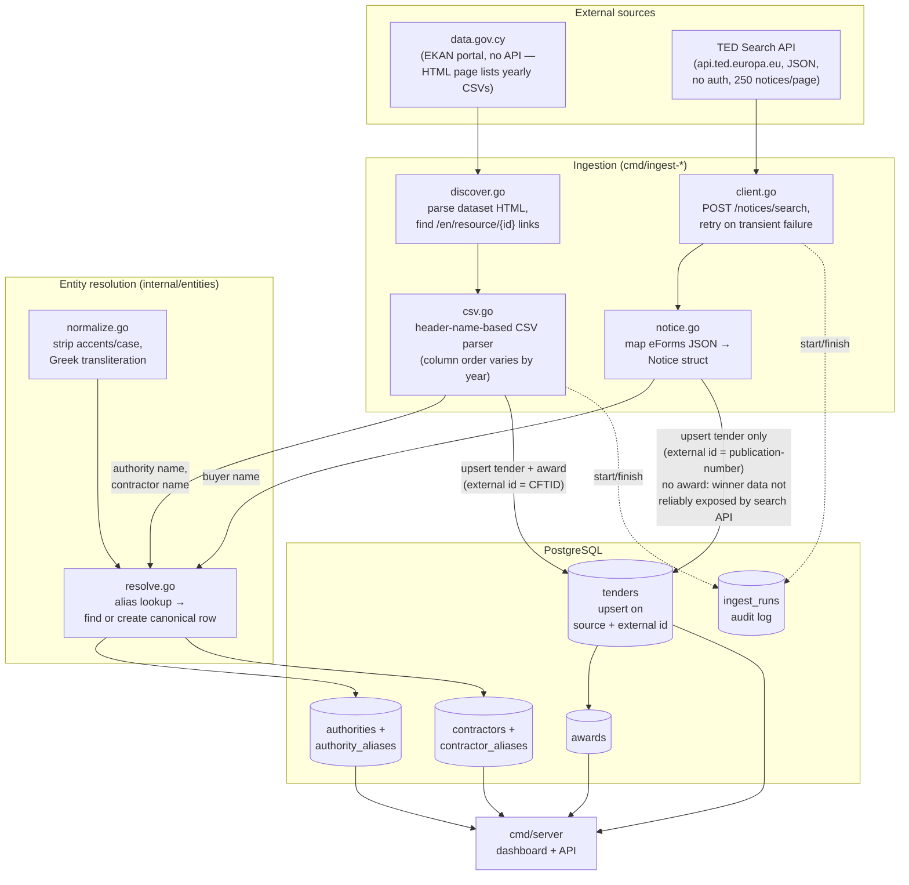

# Data ingestion

Promitheies.cy combines two live data sources today — **data.gov.cy** (Cyprus's national
awarded-contracts dataset) and **TED** (the EU's Tenders Electronic Daily notices, filtered to
Cyprus). A third source, **OpenTender**, is planned but not yet built (see [Status](#status)).

Both importers share the same shape: fetch → parse → resolve entities → upsert. Re-running
either one is always safe — every insert is keyed on a stable ID from the source, so a second
run updates existing rows instead of duplicating them.

## System diagram

## data.gov.cy

**Source shape:** the portal runs on EKAN (not CKAN — there's no documented public API). Cyprus's
awarded-contracts dataset (`/en/dataset/780`, "Κατάλογος Δημοσίων Συμβάσεων που Κατακυρώθηκαν") is
one CSV file per year, each linked from the dataset's HTML page.

**Pipeline** (`internal/datagovcy`, driven by `cmd/ingest-datagovcy`):

1. **Discover** (`discover.go`) — fetch the dataset page, regex-match every
   `<a href="/en/resource/{id}">{title}</a>` whose title contains a year (filters out unrelated
   links on the page). Returns one `Resource{ID, Title, DownloadURL}` per year — 15 of them as of
   this writing, covering 2009–2026.
2. **Fetch + parse** (`csv.go`) — download each CSV and parse it **by header name**, not column
   position. This matters: the column order (and even the column set — some years carry an extra
   duplicate `Date Published_1` column) differs between yearly files. Parsing positionally would
   silently misattribute fields on the years that don't match the newest layout.
3. **Resolve entities** (`internal/entities`) — the authority name (`ORGANIZATIONNAME`) and
   winning contractor name (`EONAME`) are resolved to canonical database rows (see
   [Entity resolution](#entity-resolution) below). A small blocklist filters out known
   placeholder values from the source data itself — e.g. `ΟΙΚΟΝΟΜΙΚΟΣ ΦΟΡΕΑΣ` ("Economic
   Operator", a generic procurement-process label, not a company) and one row explicitly marked
   `(Παρατηρητής/Test)` — which would otherwise be imported as if they were real contractors.
4. **Upsert** (`import.go`) — each row's `CFTID` (the source's own stable per-record ID) is
   stored in `tenders.external_ids->>'cftid'`. A unique partial index on
   `(source, external_ids->>'cftid')` backs an `ON CONFLICT ... DO UPDATE`, so re-importing the
   same year updates existing rows instead of duplicating them. The award (contractor + value +
   date) is upserted the same way, keyed on `(tender_id, source)`.
5. **Log** — every run writes a start/finish row to `ingest_runs` (processed/inserted counts,
   status, error message on failure), used for the "pipeline uptime" health check.

## TED (Tenders Electronic Daily)

**Source shape:** originally planned as an FTP/XML bulk feed (per the PRD), but TED also exposes
a modern, unauthenticated **REST Search API** (`api.ted.europa.eu/v3/notices/search`, POST,
JSON) — used instead, since it avoids XML/eForms parsing entirely.

**Pipeline** (`internal/ted`, driven by `cmd/ingest-ted`):

1. **Search** (`client.go`) — `POST /notices/search` with a query (`place-of-performance=CYP`,
   matching every Cyprus notice regardless of form type — open competitions, planning notices,
   award results) and an explicit list of `fields` to project (the API has ~1,800 possible field
   names; requesting a fixed field only returns error 405/validation messages listing the full
   valid vocabulary, which is how the correct field names — e.g. `classification-cpv`, not `cpv`
   — were discovered). Paginates at the API's max of 250 notices/page; retries up to 3 times on
   transient failures (observed once: the API returned an HTML gateway-error page mid-run instead
   of JSON).
2. **Parse** (`notice.go`) — maps the flat JSON projection into a `Notice`: bilingual title
   (`notice-title.eng` / `.ell`), buyer name (preferring the Greek spelling), CPV codes,
   estimated value, and a `status` derived from `form-type` (`competition`/`planning` → `open`,
   `result`/`dir-awa-pre`/`can-standard` → `awarded`).
3. **Resolve + upsert** — same authority resolution and idempotent-upsert pattern as data.gov.cy,
   keyed on `external_ids->>'ted'` = the notice's `publication-number`.
4. **Telegram notifications** — when the TED command inserts new `open` notices and
   `TELEGRAM_BOT_TOKEN` + `TELEGRAM_CHAT_ID` are set, it sends those new tenders to the configured
   Telegram group. `PUBLIC_BASE_URL` is optional and adds a `/tender/{id}` link to each
   message. `TELEGRAM_MAX_NEW_TENDER_MESSAGES` defaults to `20` to avoid flooding a group on a
   large first import; any extra notices are summarized in one final message.

**Known limitation:** the search API's flat field projection does **not** reliably expose award
winner name or award value, even on `result`-type (award) notices — verified against live data
(0 of 250 sampled Cyprus award notices had either field populated). So TED contributes tender
*metadata* (what's open, what's been decided, for roughly how much) but **no award rows** — the
winner/value side of the picture comes entirely from data.gov.cy, which does carry it reliably.

## Entity resolution

The same authority or contractor appears with different spellings across (and even within) a
single source — different casing, accents, legal-suffix variants (`Ltd` vs `Limited`), Greek vs
English. `internal/entities` handles this with one shared mechanism for both importers:

1. **Normalize** (`normalize.go`) — Unicode NFD-decompose, strip combining marks (this removes
   Greek tonos accents the same way it removes Latin diacritics), lowercase, collapse whitespace.
   Contractor names additionally get common legal suffixes stripped (`ltd`, `λτδ`, `α.ε.`, …).
2. **Resolve** (`resolve.go`) — look up the normalized form in `authority_aliases` /
   `contractor_aliases`. A hit returns the existing canonical ID. A miss creates a new canonical
   row (with a readable, Greek-transliterated slug — e.g. `Δήμος Λευκωσίας` → `dimos-leykosias`)
   plus an alias row recording this exact spelling and which source it came from, inside a
   transaction that re-checks for a race against a concurrent importer run.

This is intentionally simple (exact match on a normalized key, not fuzzy matching) — the two
importers observed have been building a shared canonical registry correctly without it: TED's
Greek buyer names resolve to the *same* authority rows data.gov.cy already created, because both
normalize identically.

## Status

| Source | Status | What it contributes |
|---|---|---|
| data.gov.cy | ✅ built, verified live | Full award history: tenders + awards (contractor, value, date) |
| TED | ✅ built, verified live | Tender metadata (open + awarded), no award rows |
| OpenTender | ⏳ not yet built | Planned as a gap-filling reconciliation pass only (per the PRD's CC BY-NC licensing constraint — never used for paid-tier features) |

Current database totals (last full import): **72,739 tenders**, **55,386 awards**, **€15.6B**
total awarded value, across **418 authorities** and **~9,200 contractors**.
